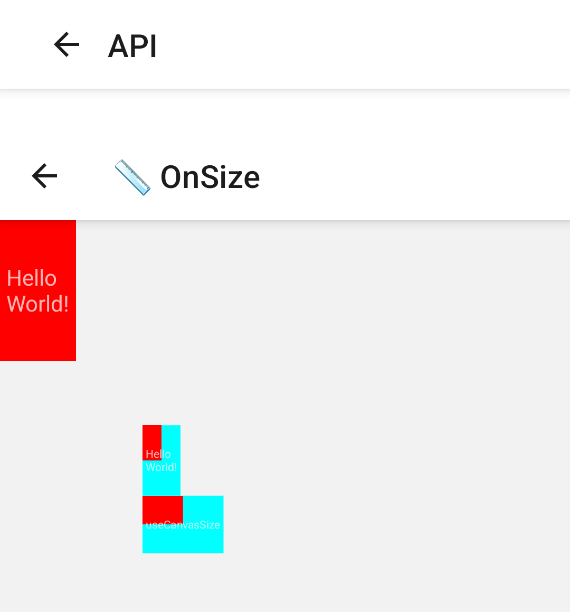
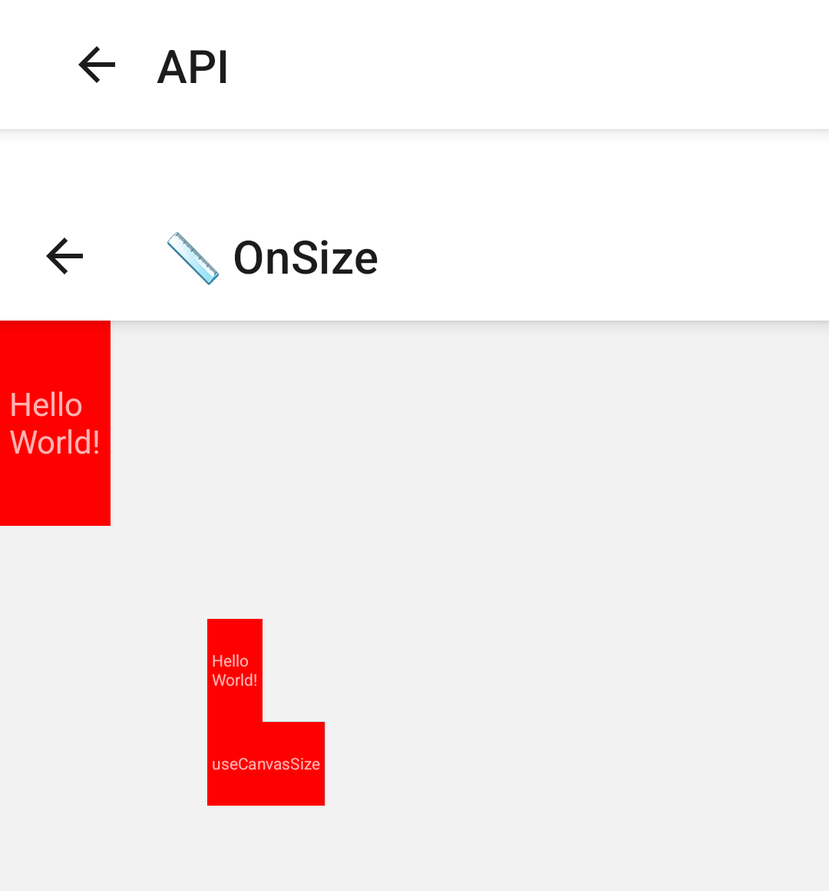

# #4086: `onSize` from the canvas's layout event

[wcandillon/react-native-skia#4086](https://github.com/wcandillon/react-native-skia/pull/4086)

## Builds

Release builds of the example app (`com.microsoft.reacttestapp`) for arm64-v8a, from a clone set up as [`packages/skia/CONTRIBUTING.md`](https://github.com/wcandillon/react-native-skia/blob/main/packages/skia/CONTRIBUTING.md) describes.

| Build | Source |
| --- | --- |
| before | `main` at `a43ef9d53`, the PR's base, with the PR's `OnSize.tsx`: a canvas sized by `onSize` and one sized by `useCanvasSize`, both under `scale: 0.5` |
| after | the PR head, `891e84f86` |

```sh
git fetch origin pull/4086/head

# before
git switch --detach a43ef9d53
git show 891e84f86:apps/example/src/Examples/API/OnSize.tsx > apps/example/src/Examples/API/OnSize.tsx

# after
git switch --detach 891e84f86

# each
cd apps/example
npx react-native bundle --entry-file index.js --platform android --dev false --minify true \
  --bundle-output dist/main.android.jsbundle --assets-dest dist/res
cd android && ./gradlew assembleRelease -PreactNativeArchitectures=arm64-v8a
```

Only the before build's bundle contains `is not supported on the new architecture`.

## Steps

1. `adb logcat -c`, then open **API › 📏 OnSize**.
2. `adb logcat -d -s ReactNativeJS:V | grep -E "new size|useCanvasSize" | sed -E 's/^.*ReactNativeJS: //; s/ @ .*//' | sort | uniq -c`

## Readings

Galaxy S23: Android 14 (API 34), Adreno 740. The last size each canvas is given:

| Canvas | before | after |
| --- | --- | --- |
| `onSize` | `48x89` | `48x89` |
| `onSize`, under `scale: 0.5` | `24x44.5` | `48x89` |
| `useCanvasSize`, under `scale: 0.5` | `51.17x36.33` | `102.33x72.67` |

The log lines are in [`readings/`](readings).

| before | after |
| --- | --- |
|  |  |

Each red rect is drawn at the size its canvas is given.
