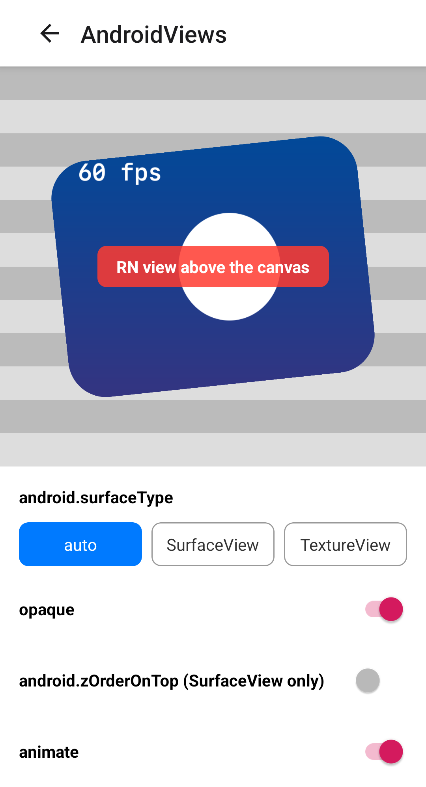
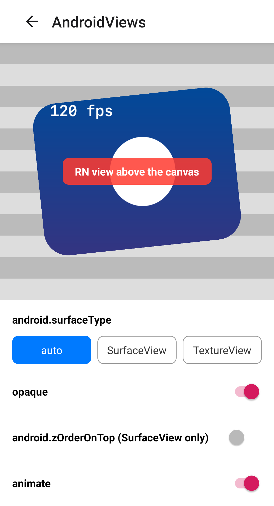

# #4102: the `SurfaceView` frame-rate vote

[wcandillon/react-native-skia#4102](https://github.com/wcandillon/react-native-skia/pull/4102)

## Builds

Release builds of the example app (`com.microsoft.reacttestapp`) for arm64-v8a, from a clone set up as [`packages/skia/CONTRIBUTING.md`](https://github.com/wcandillon/react-native-skia/blob/main/packages/skia/CONTRIBUTING.md) describes.

| Build | Source |
| --- | --- |
| before | `main` at `a43ef9d53`, the PR's base, with the PR's `AndroidViews.tsx`: the `animate` switch and the fps readout |
| after | the PR head, `0505c0692` |

```sh
git fetch origin pull/4102/head

# before
git switch --detach a43ef9d53
git show 0505c0692:apps/example/src/Examples/AndroidViews/AndroidViews.tsx > apps/example/src/Examples/AndroidViews/AndroidViews.tsx

# after
git switch --detach 0505c0692

# each
cd apps/example
npx react-native bundle --entry-file index.js --platform android --dev false --minify true \
  --bundle-output dist/main.android.jsbundle --assets-dest dist/res
cd android && ./gradlew assembleRelease -PreactNativeArchitectures=arm64-v8a
```

Only the after build's `librnskia.so` contains the string `ANativeWindow_setFrameRate`.

## Steps

On a display that adapts its refresh rate (Galaxy S23: Settings › Display › Motion smoothness › Adaptive):

1. Open **🤖 Android Views**, turn on `opaque` and `animate`, and leave the screen untouched.
2. Run [`tools/measure-surfaceflinger.sh`](../tools/measure-surfaceflinger.sh) `<adb serial>`.
3. Turn `animate` off and run it again.

## Readings

Galaxy S23: Android 14 (API 34), Adreno 740, motion smoothness Adaptive.

| Build | Canvas | `SurfaceView` layer in 10 s | Vote |
| --- | --- | --- | --- |
| before | animating | 612 frames at 60 Hz, most 16 ms apart | none |
| after | animating | 1222 frames at 120 Hz, most 8 ms apart | `120.00 Hz Default OnlySeamless` |
| before | static | no frames | none |
| after | static | no frames | none |

Mi MIX 3: Android 10 (API 29), Adreno 630, 60 Hz. The vote needs API 30.

| Build | Canvas | `SurfaceView` layer in 10 s | Vote |
| --- | --- | --- | --- |
| before | animating | 593 frames, most 16 ms apart | none |
| after | animating | 607 frames, most 16 ms apart | none |
| before | static | no frames | none |
| after | static | no frames | none |

Each row is the script's output in [`readings/`](readings).

| before | after |
| --- | --- |
|  |  |

The readout is the UI thread's frame rate.
